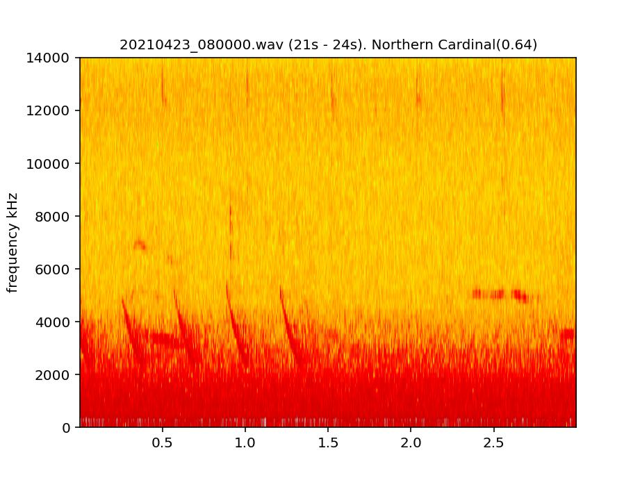

# acoustic-trials


This repository is a where I have been trying to wrap my head around processing acoustic data collected from autonomous recording units (ARUs). The ARUs I've been working with are a little unique as they are placed along urbanization gradients in a few different cities that are a part of the Urban Wildlife Information Network. One tricky aspect of audio recordings in urban areas is that there can be substantial urban noise, which we want to try to remove to get better classifications via machine learning. 

In a nutshell, the code here :
1. Splits audio files into smaller pieces (thanks to Matt Weldy for sharing some code on how to do so)
2. Uses [`mixit`](https://github.com/google-research/sound-separation) to separate sounds out of each smaller segment (i.e., remove urban noise and isolate different bird calls)
3. Sends all those sound separated segments through [`birdnet`](https://github.com/kahst/BirdNET-Analyzer) to classify bird songs and calls.
4. Save the output from birdnet, the small sound file, and a spectrogram for additional validation (if that is something you are interested in).


### Table of contents

1. [Setup](#setup)
2. [Step 1. Some initial cleaning of audio files](#step-1-some-initial-cleaning-of-audio-files)
3. [Step 2. Splitting longer audio files into smaller pieces](#step-2-splitting-longer-audio-files-into-smaller-pieces)
4. [Step 3. Separating recordings with `mixit`](#step-3-separating-recordings-with-mixit)
5. [Step 4. Run through `birdnet`](#step-4-run-through-birdnet)
6. [Step 5. Stitching it all together](#step-5-stitching-it-all-together)
7. [Future improvements](#future-improvements)
8. [Batch processing](#batch-processing)
9. [Comparison of `birdnet` classifications with and without `mixit`](comparison-of-birdnet-classifications-with-and-without-mixit)

### Setup

---

Assuming you have `anaconda` installed, open up an `anaconda` prompt to create a new environment with this:
```python
conda create -n acoustic-trials python=3.9 anaconda

```

and if you want to switch to that environment use this:
```python
conda activate acoustic-trials
```
There are also a few libraries you will need to install

```python
pip install tensorflow
pip install birdnetlib
pip install librosa
pip install resampy
```


Right now, we are going to assume we have a sub-folder titled `small_audio`, which will contain the wave files. For this example I trimmed down the 10-15 minute files to just the first 30 seconds as a proof of concept.

[Back to table of contents ⤒](#table-of-contents)

### Step 1. Some initial cleaning of audio files

---

The first ML processing step requires audio files to end in `.wav`. However, it seems like audioMoth recorders output files as `.WAV`. I made a little script to rename files if needed titled `WAV2wav.py`. This Python script renames all files with a ".WAV" extension to ".wav" in a specified folder. It uses the argparse module to parse command-line arguments and the os module to traverse the directory and rename the files.

```python
python ./python/WAV2wav.py --input_folder small_audio

```

[Back to table of contents ⤒](#table-of-contents)

### Step 2. Splitting longer audio files into smaller pieces

The audiomoths we deploy will record for minutes at a time (in this example they ran for 15 minutes every time they were triggered). This creates an issue with splitting the sound
file into seperate tracks because there are likely more than 4 distinct sounds that occur
over the whole length of the file. Consider a morning chorus for birds, there can be many
species songing all at once! Add in some urban noise and you can see how this can be an
issue. Given an `input_folder` (where you want the script to search for wav files) and an `output_folder` (where you want the script to save the new files), the script `./python/split_audio.py` can be used to recursively look through folders
and will split each file into many small pieces about 3 seconds in length. The variation that is caused here is the result of the script looking for a quite point to create a split. Where the split occurred (in seconds) will be added to the end of the file name. So, for example, if you have a wav file called `my_bird.wav` it will generate a number of files that could look something like `my_bird_0.wav` (i.e., starts at 0 seconds of the original file) or `my_bird_3.35.wav` (i.e., starts at 3.35 seconds of the original file).

```python
python ./python/split_audio.py --input_folder small_audio --output_folder split_audio
```
These files here should be treated as temporary.

NOTE: Folder hierarchy is maintained with this function, so if `--input_folder` is one folder that has data from multiple cities, each of which has multiple sites (e.g., `my_folder/<city name>/<site name>` then that hierarchy gets transferred along to `--output_folder`).


[Back to table of contents ⤒](#table-of-contents)

### Step 3. Separating recordings with `mixit`

`mixit` has "models for Unsupervised Sound Separation of Bird Calls Using Mixture Invariant Training." We use this to take in a single recording and split it into multiple tracks, which will hopefully remove urban noise. See instructions here for downloading mixit as well as tensorflow. One thing to note here is that you will need to be able to call `gsutil` from your command line to download `mixit` if you are following their directions. The easiest way to do this is to just install the `gcloud CLI`, which comes with `gsutil`. You can find that [here](https://cloud.google.com/sdk/docs/install). You can find the `gsutil` call to download `mixit` to your current directory [here](https://github.com/google-research/sound-separation/tree/master/models/bird_mixit).


To run `mixit`, there are two scripts from that repo that you need: `process_wav.py` and `inference.py`. They are already in this repository.

To run a single audio file, the python call would be:

```python
python ../tools/process_wav.py \
--model_dir bird_mixit_model_checkpoints/output_sources4 \
--checkpoint bird_mixit_model_checkpoints/output_sources4/model.ckpt-3223090 \
--num_sources 4 \
--input <input name>.wav \
--output <output_name>.wav
```

I downloaded the model to my current working directory so that `--model_dir` and `--checkpoint` can be found there.

However, each visit to a site will have multiple files (i.e., multiple days of recording). So we are going to want to be able to apply this to all `wav` files in a given folder.  So I put together `./python/mixit_audio.py` to do just that. This code processes the `wav` files in `--input_folder` and uses the pre-trained `mixit` model to generate source-separated audio files for each input file. It creates an output folder to store the processed files, and also copies over the original file into this folder as well (more on this later). 

The folder hierarchy for the output is:`output/{site visit}/name of wav file` Where `site visit` is the name of the original folder (which contains the site name and date of visit). Each of these folders will have 5 files:

1. The original sound file.
2. Four source-seperated audio files ending in `_source0.wav` through `_source3.wav`.

These files SHOULD be treated as temporary, in that after they are successfully processed in the next step they can get removed. They are currently not treated as temporary. We've pulled over the original file because that one should also be ran through birdnet (it has been shown to improve accuracy to run that one plus the source-separated files).

An example of calling this script is:

```python
python ./python/mixit_audio.py --input_folder small_audio/CHIL-CTG-04232021
```
[batch processing](#batch-processing) below for how to run this on multiple folders at once.


[Back to table of contents ⤒](#table-of-contents)

### Step 4. Run through `birdnet`

Now that we have each file for a given visit separated out into different tracks, we can run all of them through birdnet. The detections for `birdnet` are housed in a list with possibly multiple dictionaries that look something like this.


``` python
[[
{'common_name': 'American Robin', 'scientific_name': 'Turdus migratorius', 'start_time': 0.0, 'end_time': 3.0, 'confidence': 0.43399834632873535},
{'common_name': 'American Robin', 'scientific_name': 'Turdus migratorius', 'start_time': 9.0, 'end_time': 12.0, 'confidence': 0.87421541544584154}
]]
```
where each element in this list has some information about the species detected, how confident the model is, and the start and end time of the detection (relative to the start of the file itself). In the example above there are two detections within a single audio file. Because we have 5 files associated to each original file, we run `birdnet` 5 times and then summarize the detections across those 5 files. To do so I grouped them based on their start & end time within each collection of 5 files and then took the species with the highest confidence at that time across files. The script `./python/do_birdnet.py` will do all of this when given an `--input_folder`. 

This script can be run with a call like this

```python
python ./python/do_birdnet.py --input_folder output/CHIL-CTG-04232021
```
`./python/do_birdnet.py` has some additional arguments: `--output_folder` and `--csv_name`. `--output_folder` takes a default value of `snips` and is where all spectrograms and cut sound files that `birdnet` ID'd are located. If specified, `--csv_name` will generate a csv with all the bird detections within `--output_folder`. You do not need to add `.csv` to the end of `--csv_name`. 

```python
python ./python/do_birdnet.py --input_folder output/CHIL-CTG-04232021 --output_folder birds_ids --csv_name birdnet_calls 
```

An example of the spectrogram that gets output is

<div align="center"></div>

Additionally, this script has also been generalized to run on all files nested within a single folder. So, for example, if we wanted to process the entire `output` folder we could just run

```python
python ./python/do_birdnet.py --input_folder output  --output_folder birds_ids --csv_name birdnet_calls 
```

[Back to table of contents ⤒](#table-of-contents)

### Step 5. Stitching it all together

Really the only thing that needs to get pointed at is a folder to start from, everything else functions off of that. The script in the main repo called `do_all.py` does steps 1 through 3.

```
python do_all.py --input_folder small_audio/CHIL-CTG-04232021
```

[Back to table of contents ⤒](#table-of-contents)

### Future improvements

There are quite a few variables throughout this that are hard-coded, or pulled off of the `--input_folder` argument. When interfacing with the UWIN web app a number of these bits of information can actually be pulled from specific tables in the database, namely to date & time of a visit to a given location as well as that locations coordinates. Finally, after the ML outputs are collected we really don't need to store all of the separated 'tracks.' What we really just need are:

1. The original soundfile stored in the coldest of cold storages.
2. The small bits of soundfiles that are the species detections stored in something that can possibly be verified by a user. In this example these are getting stored in the snips sub-folder. These files, if a validation flow is generated, can be moved to cold storage once they have been validated.
3. The spectrograms that are associated to those soundfiles as well so there is a visual as well as an auditory representation. In this example these are getting stored in the snips sub-folder.

I built this script with the thought in mind that the function would get called once a user tells them to apply all the ML to a given visit. That being said, it may make sense to be able to batch process them by having a user select those across a given time range (e.g., a month). We should also
keep track of whether or not a given batch of files have completed the ML pipeline so that we can ensure they are not sent through it again (as that could add up). 

I am positive there is other stuff I am missing here, but at a minimum these scripts are at least a proof of concept that this pipeline works.

[Back to table of contents ⤒](#table-of-contents)

### Batch processing

Since I've been testing this out on my local computer I also wanted a way to batch process more than one folder (e.g., all the sub-folders within another audio folder). To batch process files with `mixit` I wrote the script `./python/batch_mixit.py`. This script assumes there is some hierarchy in the folder structure in order to batch process things. The overall layout of the folders should be something like

```
<parent folder>/<study area sub-folders>/<visits to sites sub-folders>
```

You can point `./python/batch_mixit.py` at any part of the folder hierarchy and it will work. Take, for example, if `<parent folder> = ./audio` with this hierarchy.

```
audio
  CHIL
    VID121_20230404
      VID121_000.wav
      VID121_001.wav
    VID122_20230405
      VID122_000.wav
      VID122_001.wav
  ININ
    VID845_20230501
      VID845_000.wav
      VID845_001.wav
    VID847_20230502
      VID847_000.wav
      VID847_001.wav
  JAMS
    VID125_20230501
      VID125_000.wav
      VID125_001.wav
    VID126_20230502
      VID126_000.wav
      VID126_001.wav

```

Where the associated `.wav` files are in the `VID` (visitID) folders. To process everything with `mixit` you would call

```python
python ./python/batch_mixit.py --input_folder audio
```

This will create a folder called `output` within `audio`, which will store all sound separated files and copy the folder hierarchy except each `wav` filename will now be a folder (e.g., `VID126_001`), and that will store the 5 sound separated files. If you just wanted to process the data from `CHIL`

```python
python ./python/batch_mixit.py --input_folder audio/CHIL
```

or just one site

```python
python ./python/batch_mixit.py --input_folder audio/CHIL/VID121_20230404
```

### Calculate relative noise in files

One additional component we would want to calculate is how noisy each snipped file is to get an idea for how much background noise there is, which could be important to know how certain we should be with respect to `BirdNET` IDs. To do so you can use the script `./python/calc_spl.py`. This script should be run on the files before they are sent through `mixit`, and as such may be best used directly after splitting the data. I think that this script could have better error handling, at this moment if it fails it spits something out into the console and then just keeps processing the files. 

```python
python ./python/split_audio.py --input_folder small_audio --output_folder split_audio
python ./python/calc_spl.py --input_folder split_audio --csv_name spl_file
```

The output of this script is a csv file with two columns: `path` and `mean_dB`, which represent the filepath and the relative dB between 1000 and 4000 Hz (which is the range where most urban noise is). Note that this is not a true dB measurement, it is just relative, because we'd have to know much more information about a recording unit to quantify the true dB.

[Back to table of contents ⤒](#table-of-contents)

